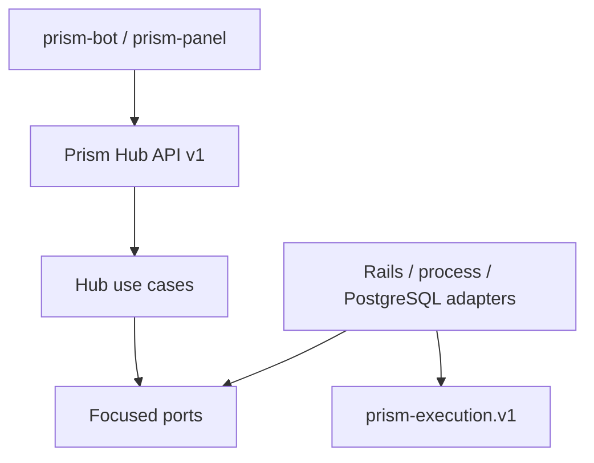

# Prism Hub

Prism Hub is the control-plane boundary for Prism installations. It exposes one
versioned client API, resolves public channel IDs to server-side Prism bindings,
and invokes `prism-execution.v1` without duplicating provider behavior.

This repository is the first executable foundation, not a claim that the whole
control plane exists. It currently provides:

- bearer-authenticated `v1` endpoints for idempotent actor onboarding, actor
  resolution, channel discovery, validation, and publication;
- multi-target publication requests whose provider, channel, and credential
  bindings stay server-side;
- an injected Prism execution port with a hardened local-process adapter;
- explicit Clean Architecture boundaries and framework-independent tests;
- an OpenAPI 3.1 contract intended for generated clients such as `prism-bot`.

Social accounts, OAuth flows, scheduling, publication persistence, approvals,
audit history, and production packaging remain later increments. The current
Prism runtime also needs a production composition root before this foundation
can publish through the live Threads adapter; Instagram publishing is not
implemented in `prism` yet.

## Dependency boundary



Clients submit public `channel_id` values. Only the environment-backed channel
repository can expand them into `provider_id`, `channel`, and `credential`
references. Raw provider tokens are never accepted by the API.

## Local setup

1. Install Ruby `4.0.6` and PostgreSQL.
2. Copy `.env.example` values into your process environment.
3. Install dependencies with `bundle install`.
4. Run `bin/rails server`.

Scoped client credentials are the primary authentication path. The legacy
`PRISM_HUB_API_TOKEN` is read only when
`PRISM_HUB_LEGACY_TOKEN_ENABLED=true`; otherwise Hub does not require it.
`PRISM_HUB_CHANNELS_JSON` is an array of configured channels:

```json
[
  {
    "id": "personal-threads",
    "label": "Personal Threads",
    "provider_id": "meta.threads",
    "channel_ref": "0x0sky",
    "credential_ref": "threads.personal",
    "capabilities": {
      "formats": ["post"],
      "text": true,
      "media_kinds": []
    }
  }
]
```

`PRISM_RUNTIME_COMMAND_JSON` must be a JSON array, not a shell command string.
The default is `["prism-runtime", "--json"]`.

## API

The canonical contract is [`openapi/prism-hub.v1.yaml`](openapi/prism-hub.v1.yaml).

| Endpoint | Purpose |
| --- | --- |
| `GET /healthz` | Process liveness only |
| `POST /api/v1/actors/onboard` | Resolve or create an identity, personal workspace, and owner membership |
| `POST /api/v1/actors/personal/resolve` | Resolve an existing personal actor without creating state |
| `POST /api/v1/actors/resolve` | Resolve provider evidence and verify human workspace membership |
| `GET /api/v1/channels` | Paginated public channels and publishing capabilities |
| `POST /api/v1/publications/validate` | Complete Prism preflight, no publish action |
| `POST /api/v1/publications` | Explicit multi-target publish request |

API calls require `Authorization: Bearer …`; publication calls also require an
`Idempotency-Key` header. Validation never crosses the provider publish
boundary. Publication behavior is selected explicitly with
`require_all_valid` or `independent`.

Channel discovery accepts `limit` (1–100, default 50) and an opaque `cursor`.
Every HTTP response carries `X-Request-ID`; typed HTTP error bodies repeat the
same value as `request_id` for support correlation. Channel capabilities are
declarative configuration and must match the active Prism provider adapter.

## Verification

```bash
bundle exec rubocop
bundle exec brakeman --no-pager --quiet -w2
bundle exec rails test
bundle exec rails zeitwerk:check
bundle exec rake prism_hub:check
```

The normative ecosystem rules live in Prism's
[`engineering-principles.md`](https://github.com/aiaiaiai-org/prism/blob/master/docs/engineering-principles.md).
Repository-specific boundaries are described in
[`docs/architecture.md`](docs/architecture.md), and the precise implemented/TODO
split is in [`docs/status.md`](docs/status.md).

No public software license has been selected for this repository yet. The
source is publicly visible, but `prism`'s Apache-2.0 license must not be inferred
to apply here.

<!-- © 2026 aiaiaiai · aiaiaiai.org -->
