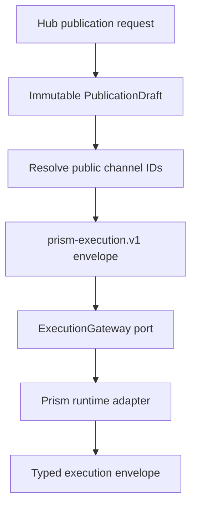

# Architecture

Prism Hub follows the normative Prism engineering principles. Its required
shape is Clean Architecture: domain and use-case policy depend only on focused
ports; Rails, JSON, processes, PostgreSQL, jobs, and future OAuth providers stay
in outer adapters.

## Ownership

| Boundary | Owns | Must not own |
| --- | --- | --- |
| Domain | Immutable Hub channel and publication-request values | Rails, JSON parsing, provider HTTP, persistence |
| Use cases | Channel discovery and execution orchestration | Process spawning, provider tokens, HTTP responses |
| Ports | Focused channel lookup and Prism execution capabilities | Concrete storage or runtime choices |
| Adapters | Environment configuration and local process mechanics | Hub application policy |
| HTTP interface | Authentication, decoding, status mapping, OpenAPI surface | Provider or dispatch policy |

The Rails application is a host and future persistence/job framework. The
versioned HTTP surface is a Rack adapter constructed with explicit dependencies;
inner objects never resolve themselves from Rails configuration or global state.

## Publication flow

The client controls target order, variant selection, and dispatch policy. It
does not send provider IDs, channel references, credential references, or raw
tokens. The Hub expands those values from its server-side channel repository.

## Security boundary

- Hub API bearer credentials are distinct from provider credentials.
- Request bodies have a bounded size and strict top-level fields.
- Runtime commands are JSON arrays passed directly to `exec`; no shell parses
  environment-controlled command text.
- Runtime stdout is size-bounded and contract-checked. Stderr and request
  payloads are never reflected to clients.
- A timeout or malformed runtime response is observable as a stable `503`, not
  retried implicitly.
- `outcome_unknown` remains a Prism result and must never be transformed into a
  normal retryable failure.

## Extension rules

New persistence, OAuth, scheduler, or job implementations enter as adapters to
new focused ports only when a proven use case needs them. New providers do not
add branches to Hub policy: they are configured as channels and implemented in
`prism`. A remote execution transport may replace the process adapter without
changing use cases or the public API.

<!-- © 2026 aiaiaiai · aiaiaiai.org -->
