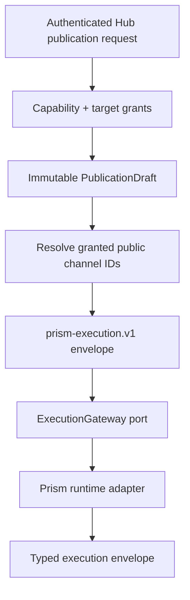

# Architecture

Prism Hub follows the normative Prism engineering principles. Its required
shape is Clean Architecture: domain and use-case policy depend only on focused
ports; Rails, JSON, processes, PostgreSQL, jobs, and future OAuth providers stay
in outer adapters.

## Ownership

| Boundary | Owns | Must not own |
| --- | --- | --- |
| Domain | Immutable Hub channel, publication-request, and authorisation values | Rails, JSON parsing, provider HTTP, persistence |
| Use cases | Channel discovery, execution orchestration, authorization policy, and client-credential lifecycle | ActiveRecord, process spawning, provider tokens, HTTP responses |
| Ports | Focused channel lookup, Prism execution, principal persistence, and client-credential persistence capabilities | Concrete storage or runtime choices |
| Adapters | Environment configuration, PostgreSQL records/repositories, secret generation, and local process mechanics | Hub application policy |
| HTTP interface | Bearer extraction, request decoding, status mapping, OpenAPI surface | Provider, dispatch, capability, or channel authorization policy |

The Rails application is a host and persistence/job framework. The versioned HTTP
surface is a Rack adapter constructed with explicit dependencies; inner objects
never resolve themselves from Rails configuration or global state.

## Client identity and authorization

The PostgreSQL identity boundary consists of normalized workspace,
service-principal, client-credential, capability-grant, and channel-grant tables.
ActiveRecord record classes live only under the adapter namespace. Domain,
use-case, and port files remain framework-independent and are checked in CI for
forbidden outward dependencies.

A service principal identifies one machine client globally; it does not identify
a human workspace or a bot lifecycle instance. Grants belong to that stable
principal, never to an individual credential. Credential issue therefore cannot
mutate grants. Credential issue generates a high-entropy
opaque `prism_client_v1_…` secret and stores only its SHA-256 digest. Expiry and
revocation are evaluated during credential lookup. Rotation creates the
replacement and revokes the prior credential in one database transaction;
revocation is idempotent.

The HTTP authenticator extracts a bearer secret and resolves it through the
credential repository to an immutable workspace-independent
`AuthorisationContext`. Missing, malformed, expired, or revoked credentials
produce `401`. A valid principal
without the required capability or channel grant produces `403` from application
use cases.

Actor resolution receives an explicit target workspace and proves access through
the resolved human identity's active `WorkspaceMembership`. A machine credential
can therefore serve multiple workspaces without becoming evidence for any one
human tenant. Historical workspace and bot-instance columns are retained only as
nullable migration data until the separate bot lifecycle model is introduced.

Channel discovery requires `channels:read` and paginates only across granted
channels, so ungranted channel metadata is not exposed. Publication validation
and publishing require `publications:validate` and `publications:publish`
respectively. Every explicit target must be granted; if any target is denied the
entire request fails before channel lookup or Prism execution. Targets are never
silently filtered.

A legacy global bearer token exists only as an explicit migration bridge. It is
disabled by default with `PRISM_HUB_LEGACY_TOKEN_ENABLED=false`; enabling it
constructs an explicit migration context with all currently configured channels
and capabilities. Merely setting `PRISM_HUB_API_TOKEN` does not activate it.

## Publication flow

The client controls target order, variant selection, and dispatch policy. It
does not send provider IDs, channel references, credential references, or raw
tokens. The Hub expands those values from its server-side channel repository only
after authorization succeeds.

## Security boundary

- Hub API credentials are distinct from provider credentials.
- Raw scoped client credentials are never persisted or included in `inspect` output.
- Invalid authentication and insufficient authorization remain distinct `401`/`403` states.
- Ungranted channel discovery is filtered before pagination; explicit publication targets fail closed.
- Request bodies have a bounded size and strict top-level fields.
- Runtime commands are JSON arrays passed directly to `exec`; no shell parses environment-controlled command text.
- Runtime stdout is size-bounded and contract-checked. Stderr and request payloads are never reflected to clients.
- A timeout or malformed runtime response is observable as a stable `503`, not retried implicitly.
- `outcome_unknown` remains a Prism result and must never be transformed into a normal retryable failure.

## Extension rules

New OAuth, scheduler, channel-persistence, or job implementations enter as
adapters to new focused ports only when a proven use case needs them. New
providers do not add branches to Hub policy: they are configured as channels and
implemented in `prism`. A remote execution transport may replace the process
adapter without changing use cases or the public API.

<!-- © 2026 aiaiaiai · aiaiaiai.org -->
