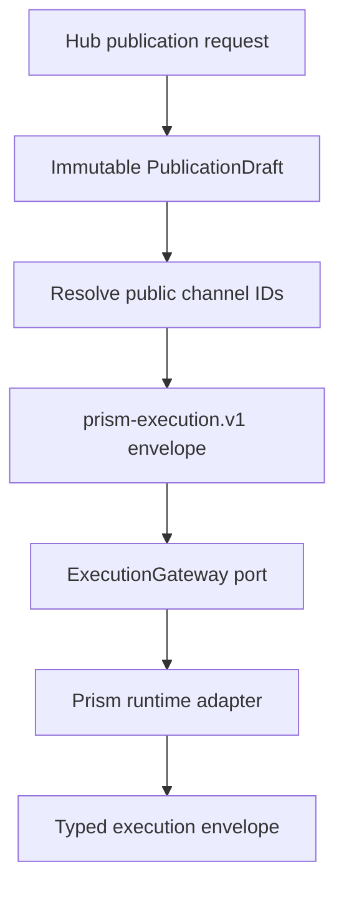

# Architecture

Prism Hub follows the normative Prism engineering principles. Its required
shape is Clean Architecture: domain and use-case policy depend only on focused
ports; Rails, JSON, processes, PostgreSQL, jobs, and future OAuth providers stay
in outer adapters.

## Ownership

| Boundary | Owns | Must not own |
| --- | --- | --- |
| Domain | Immutable Hub channel, publication-request, and authorisation values | Rails, JSON parsing, provider HTTP, persistence |
| Use cases | Channel discovery, execution orchestration, service-principal provisioning, and client-credential lifecycle | ActiveRecord, process spawning, provider tokens, HTTP responses |
| Ports | Focused channel lookup, Prism execution, service-principal, and client-credential persistence capabilities | Concrete storage or runtime choices |
| Adapters | Environment configuration, PostgreSQL records/repositories, secret generation, and local process mechanics | Hub application policy |
| HTTP interface | Authentication, decoding, status mapping, OpenAPI surface | Provider or dispatch policy |

The Rails application is a host and persistence/job framework. The versioned HTTP
surface is a Rack adapter constructed with explicit dependencies; inner objects
never resolve themselves from Rails configuration or global state.

## Principal and credential persistence

The first PostgreSQL persistence boundary consists of normalized workspace,
service-principal, client-credential, capability-grant, and channel-grant tables.
ActiveRecord record classes live only under the adapter namespace. Domain,
use-case, and port files remain framework-independent and are checked in CI for
forbidden outward dependencies.

A service principal is bound to one workspace and one `bot_instance_id`.
Capabilities and channel grants belong to that stable principal, never to an
individual credential. Principal provisioning is explicit and idempotent only
when the requested identity and grants exactly match the existing state. A grant
mismatch fails observably; credential issue, rotation, and revocation cannot
change permissions. Future grant changes therefore require their own explicit
use case rather than piggybacking on credential lifecycle.

Credential issue requires an already provisioned active principal, generates a
high-entropy opaque `prism_client_v1_…` secret, and stores only its SHA-256
digest. Expiry and revocation are evaluated during lookup. Rotation creates the
replacement and revokes the prior credential in one database transaction;
revocation is idempotent.

The credential persistence adapter resolves a valid credential into an immutable
`AuthorisationContext` containing the public workspace/principal identifiers,
normalized capabilities, and normalized channel grants. This PR deliberately
does not replace the existing HTTP global-token authentication yet; that wiring
is the next dependent increment so persistence and HTTP policy remain separately
reviewable.

## Publication flow

The client controls target order, variant selection, and dispatch policy. It
does not send provider IDs, channel references, credential references, or raw
tokens. The Hub expands those values from its server-side channel repository.

## Security boundary

- Hub API credentials are distinct from provider credentials.
- Raw scoped client credentials are never persisted or included in `inspect` output.
- Credential lifecycle cannot mutate service-principal grants.
- Request bodies have a bounded size and strict top-level fields.
- Runtime commands are JSON arrays passed directly to `exec`; no shell parses environment-controlled command text.
- Runtime stdout is size-bounded and contract-checked. Stderr and request payloads are never reflected to clients.
- A timeout or malformed runtime response is observable as a stable `503`, not retried implicitly.
- `outcome_unknown` remains a Prism result and must never be transformed into a normal retryable failure.

## Extension rules

New OAuth, scheduler, channel-persistence, grant-management, or job
implementations enter as adapters to new focused ports only when a proven use
case needs them. New providers do not add branches to Hub policy: they are
configured as channels and implemented in `prism`. A remote execution transport
may replace the process adapter without changing use cases or the public API.

<!-- © 2026 aiaiaiai · aiaiaiai.org -->
